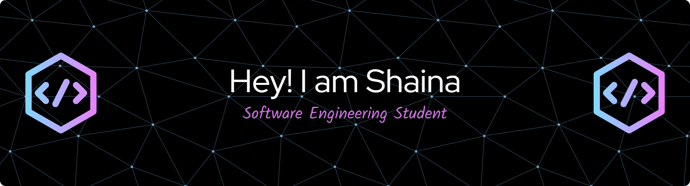

### Hey there, I'm Shaina! 👋  
Welcome to my little corner of the internet 🌌

I'm a passionate tech Software Engineering Student exploring the exciting world of **Python**, **Machine Learning**, and **Cloud Computing**. Right now, I'm sharpening my skills in **front-end development**, **UX/UI design**, and **AWS Cloud** — with a love for building sleek, responsive interfaces and smart applications that solve real problems.

✨ **What drives me?**  
- Crafting beautiful front-end experiences with React and Tailwind  
- Exploring the limitless potential of AI and cloud technologies  
- Building scalable apps and testing workflows that just work  
- Learning, sharing, and collaborating with other devs and creatives

🎃 Outside the code:  
I’m a horror & Halloween lover, cosmic dreamer, travel junkie, and a proud foodie who’s always hunting for the next great bite.

💬 **Let’s connect!**  
Whether it’s a front-end collab, a cloud-based side project, or just a shared love for spooky season — feel free to reach out and let's build something amazing together.

<!---
poisonivy91/poisonivy91 is a ✨ special ✨ repository because its `README.md` (this file) appears on your GitHub profile.
You can click the Preview link to take a look at your changes.
--->
